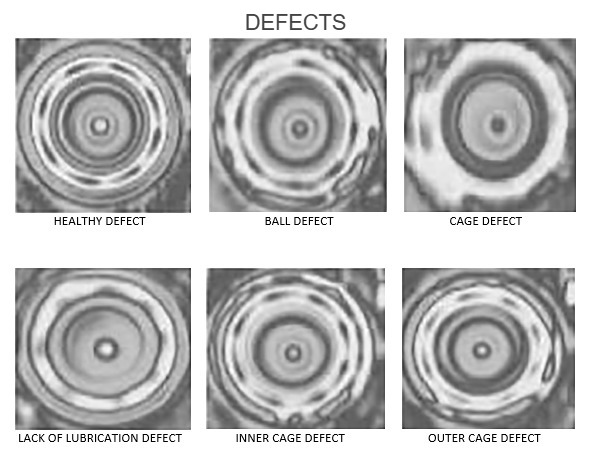

# 🔧 Ball Bearing Predictive Maintenance using Thermal Imaging

 

This project implements a deep learning pipeline for **predictive maintenance of ball bearings using thermal imaging data** using **ResNet-50** model.  
It trains on a training dataset of thermal images and performs predictions on a thermal video (created by combining thermal images from validation dataset).  
The model detects abnormal heat signatures to classify the type of defect or confirm healthy condition.

Developed using the **Spyder IDE**.

---

## 🚀 Features
✅ Trains a multi-class classifier for 6 defect types  
✅ Uses thermal images for training & thermal video for testing
✅ Frame-level and video-level predictions with visualizations  
✅ Machine Learning pipeline with modular components  
✅ *Backbone*: **ResNet-50** — robust, deep, and transfer-learning friendly.
🚧 *Upcoming*: Integration of real-time thermal camera feed & monitoring dashboard

---

## 🔍 Classes Detected
The model predicts one of the following six conditions:
- 🔷 **Ball defect**
- 🔷 **Cage defect**
- 🔷 **Healthy**
- 🔷 **Inner race defect**
- 🔷 **Lack of lubrication**
- 🔷 **Outer race defect**

---

## 🖼️ Preview

---

## 🧰 Why ResNet-50?
We used **ResNet-50** instead of a plain CNN because:
- 🔷 Enables **deeper networks** (50+ layers) thanks to residual (skip) connections.
- 🔷 Solves the **vanishing gradient problem**, ensuring better training even at depth.
- 🔷 Learns better hierarchical & fine-grained features crucial for distinguishing subtle thermal differences.
- 🔷 Pretrained weights available → enables transfer learning → faster training & better accuracy on limited data.
- 🔷 Proven state-of-the-art for image classification tasks, including industrial & thermal imaging.

---

## 📝 Future Work
🌟Planned upgrade: integrate a real-time thermal camera to stream live data.
🌟Each frame will be analyzed using the trained model, and predictions will be visualized in an interactive dashboard for live monitoring

